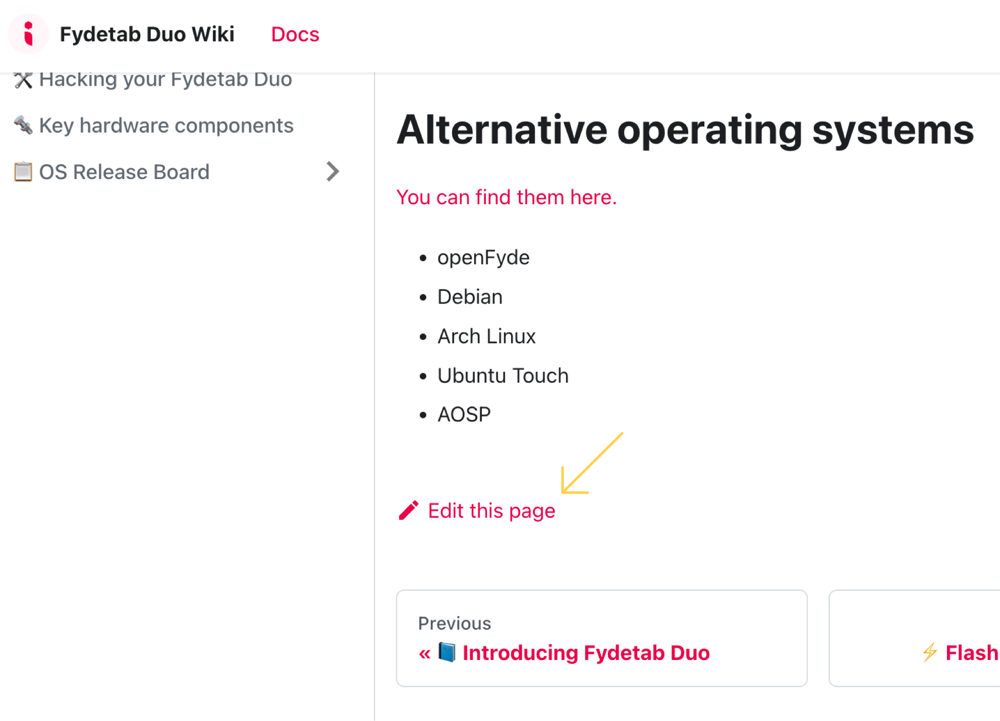

# Fydetab Duo Wiki Project 📚

Welcome to the **Fydetab Duo Wiki Project**, your go-to source for comprehensive information on the Fydetab Duo. This project is designed to be an interactive and detailed knowledge base for users.

## About 🌟

The Fydetab Duo Wiki is a curated repository aimed at providing support and insights for users, offering everything from setup guides to advanced tips.

## Contributing 🤝

Your contributions are essential to the success of this project. You can help by updating existing content or adding new information.

### How to Contribute

- **Make Edits:** Click the `Edit this page` button at the bottom of any page to start editing.

- **Submit Changes:** After editing, submit a pull request. We will review your changes and, if appropriate, merge them into the main documentation.
- **Stay Engaged:** Your changes, once reviewed and accepted, will be incorporated and made available to all users.

## Join Us 🌍

By contributing to the Fydetab Duo Wiki, you become part of a community dedicated to enhancing everyone's experience with Fydetab Duo. We value your input and look forward to your contributions!
