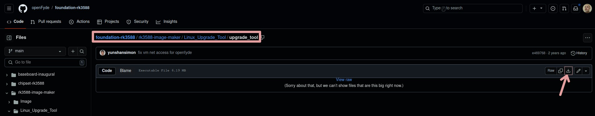

Here is a step-by-step guide for flashing a new OS onto your Fydetab Duo.

## To make Fydetab Duo boot into Loader Mode

### 1. Prepare your device

- Assure that your Fydetab Duo has been shutdown before connecting it with a usb cable to your computer.
- Connect your Fydetab Duo to the computer you'll use for the OS flash.
:::note
Due to an oversight by our factory supplier, the type-c cable that comes with the Fydetab Duo doesn’t support data transfer, so you won’t be able to get into Loader Mode with it. Please use a different type-c cable that can handle data transfers.
:::
- Ensure the device is powered off before proceeding. If it powers on automatically, turn it off again to avoid unintended operations.

### 2. Enter Loader/Maskrom Mode

- **Step 1:** Press and hold the volume up (vol+) button.
- **Step 2:** While holding the vol+ button, briefly press the power button for 0.5 to 1 second.
- **Step 3:** Release both buttons simultaneously to Enter **Loader Mode** (Note: If releasing the buttons simultaneously does not work, it is better to release the power button and afterwards the vol+ button).
- **Step 4 (Windows only):** Use RockdevTool to switch to **Maskrom Mode** (see Windows section below).


### 3. Check the status

If successful, your flashing device should be able to connect to the Fydetab Duo.

> [!NOTE]
> On devices with first generation firmware: The device’s LED will remain off, and the screen will stay completely dark.
>
> On devices with later generation firmware: The screen displays an image indicating that the device is in Loader Mode. Note that this image may not always appear due to display issues.

## Utilising an image flashing tool

Unix based systems can flash images onto the Fydetab Duo by using Rockchip's upgrade tool. Windows systems use their RKDevTool.

### Using Linux

The linux upgrade tool is a proprietary solution developed by Rockchip for flashing images onto various storage devices such as SPI, eMMC, SD Card, and more. Unlike open-source [rkdeveloptool](https://github.com/rockchip-linux/rkdeveloptool) software, this tool does not provide access to its source code. Instead, it is distributed solely in **binary executable** form, allowing users to utilize the provided executable files for the purpose of flashing images onto their desired storage devices.

The `upgrade_tool` binary can be downloaded from within openFyde's GitHub repository: [openFyde/foundation-rk3588](https://github.com/openFyde/foundation-rk3588/blob/main/rk3588-image-maker/Linux_Upgrade_Tool).

Checkout the following [GitHub repository](https://github.com/vicharak-in/Linux_Upgrade_Tool) regarding required software dependencies and usage.

#### Download & installation

Follow the Link [upgrade_tool](https://github.com/openFyde/foundation-rk3588/blob/main/rk3588-image-maker/Linux_Upgrade_Tool/upgrade_tool) and download the file in raw format onto your computer. The raw download button on GitHub is located at the top right corner of the page as shown in the image below. Any location will do to save and execute the file (e.g. `~/Downloads/`, `/opt/Linux_Update_Tool/`, `/usr/bin/`).



Open a terminal and make the downloaded file executable:

```
sudo chmod +x /path/to/upgrade_tool
```

#### Flash an image

:::note
Unarchive compressed downloaded images using your favourite tool before flashing them!
:::

Fire up a terminal session and issue the following command:

```
sudo ./path/to/upgrade_tool uf /path/to/unarchived/image-name.img
```

### Using macOS

> Require macOS > 10.15
- Download the upgrade tools [here](https://download.fydeos.io/utils/upgrade_tool_v2.3_mac.zip).
- Unarchive the downloaded update image file using your favourite tool.
- Fire up a terminal session and issue the following commands:
  ```
  chmod +x upgrade_tool
  sudo ./upgrade_tool uf <filename of the update image>.img
  ```

### Using Windows

- Download and install the [Rockchip Driver](https://dl.radxa.com/tools/windows/DriverAssitant_v5.0.zip).
- Download the RKDevTool [here](https://download.fydeos.io/utils/windows_RKDevTool_Release_v2.92.zip).
- It's a GUI tool, so it's pretty self-explanatory. For detailed instructions, [here](https://wiki.radxa.com/Android/android_tool) and [here](https://opensource.rock-chips.com/wiki_AndroidTool) are good references.

  - To flash the official images use the second tab of the software


## See also

[Linux_Upgrade_Tool - Rockchip open source Document](https://opensource.rock-chips.com/wiki_Upgradetool)

[vicharak-in/Linux_Upgrade_Tool: // Rockchip Upgrade Tool for flashing images to Linux](https://github.com/vicharak-in/Linux_Upgrade_Tool)

[Rock/flash the image - Radxa Wiki](https://wiki.radxa.com/Rock/flash_the_image)

[Radxa Index & Download of tools](https://dl.radxa.com/tools/)
